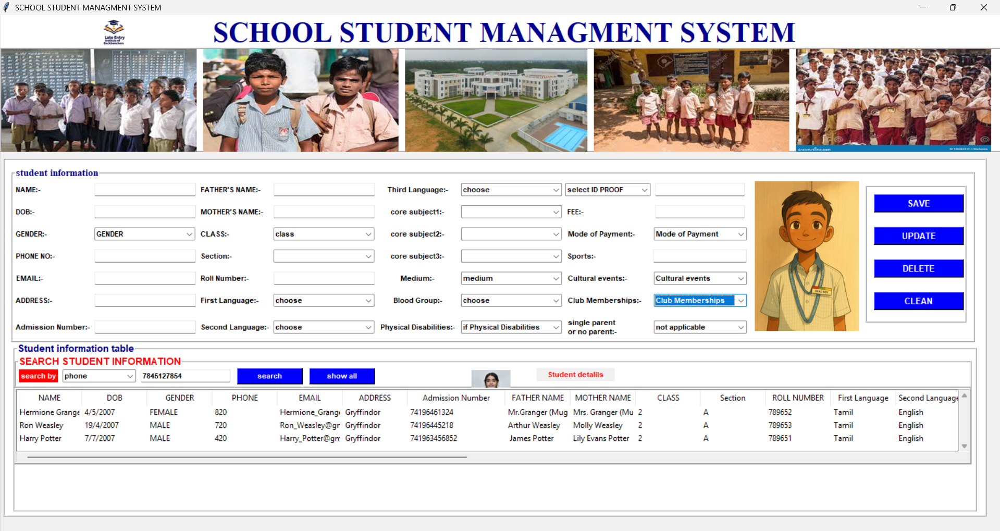

# 🏫 School Student Management System

A desktop GUI application built with **Python (Tkinter)** and **MySQL** that allows a school to digitally manage student records — add, update, delete, and search student information through a single, organized interface.



---

## 📌 Table of Contents

1. [Project Overview](#project-overview)
2. [Features](#features)
3. [Tech Stack](#tech-stack)
4. [Project Structure](#project-structure)
5. [Database Schema](#database-schema)
6. [How the Code Works (Detailed Walkthrough)](#how-the-code-works-detailed-walkthrough)
7. [Setup & Installation](#setup--installation)
8. [How to Run](#how-to-run)
9. [Known Limitations](#known-limitations)
10. [Future Improvements](#future-improvements)
11. [Author](#author)

---

## Project Overview

This project is a **single-window desktop application** for managing student admission records in a school. It was built using:

- **Tkinter** for the graphical interface (forms, buttons, dropdowns, tables)
- **MySQL** as the backend database to permanently store student data
- **PIL (Pillow)** to load and display images (logo, banner photos, student photo)

The application lets a school administrator **type in a student's details once**, click **Save**, and the data is permanently written into a MySQL database. The same window also displays **all saved students in a table** at the bottom, and lets the admin **search, update, or delete** any record by clicking on it.

---

## Features

| Feature | Description |
|---|---|
| **Add Student** | Fill the form and click `SAVE` to insert a new student record into MySQL |
| **Update Student** | Click a row in the table (auto-fills the form), edit any field, click `UPDATE` |
| **Delete Student** | Click a row, click `DELETE` — removes that student's record using their ID Proof number |
| **Search** | Search students by **Phone Number** or **ID Proof** using the dropdown + search box |
| **Show All** | Reloads and displays every record from the database |
| **Clear Form** | Resets all input fields back to default/empty values |
| **Image Display** | Shows a school logo, 5 banner images, and a student photo placeholder |
| **Scrollable Data Table** | Displays all 29 fields per student in a horizontally/vertically scrollable table |

---

## Tech Stack

| Component | Technology Used |
|---|---|
| GUI Framework | `tkinter`, `tkinter.ttk` (for Combobox, Treeview, Entry, Scrollbar) |
| Image Handling | `PIL` / `Pillow` (`Image`, `ImageTk`) |
| Database | `MySQL` |
| Database Connector | `mysql.connector` (the official MySQL driver for Python) |
| Language | Python 3 |

---

## Project Structure

```
SCHOOL-managnemt/
│
├── SCHOOL_MANAGNEMT.py     # Main application file — all GUI + logic
├── config_sample.py          # Template for database credentials (no real password)
├── config.py                 # Your actual DB credentials — NOT uploaded to GitHub (see .gitignore)
├── .gitignore                # Tells Git which files/folders to ignore
├── school img/                # Folder containing all images used in the GUI
│   ├── AMS.jpg                # Small logo, top-left corner
│   ├── 1.jpg                  # Banner image 2
│   ├── 2.jpg                  # Banner image 1
│   ├── 3.jpg                  # Banner image 3
│   ├── 4.jpg                  # Banner image 4
│   ├── 5.jpg                  # Student photo placeholder
│   ├── 6.jpg                  # Small icon next to search bar
│   └── schoolimg.jpg          # Center banner image (school building)
└── README.md                  # This file
```

> **Note:** `config.py` is intentionally excluded from GitHub using `.gitignore` because it contains the real MySQL password. Anyone who clones this repo must create their own `config.py` using `config_sample.py` as a template (instructions below).

---

## Database Schema

The application expects a MySQL database named **`school_managnemt`** with a table called **`school_details`** containing the following **29 columns**, in this exact order (since the `INSERT` statement uses positional `%s` placeholders):

| # | Column Name | Type (suggested) | Description |
|---|---|---|---|
| 1 | NAME | VARCHAR(100) | Student's full name |
| 2 | DOB | VARCHAR(20) | Date of birth |
| 3 | GENDER | VARCHAR(10) | Male / Female / Other |
| 4 | PHONE | VARCHAR(15) | Contact phone number |
| 5 | EMAIL | VARCHAR(100) | Contact email |
| 6 | ADDRESS | VARCHAR(255) | Home address |
| 7 | `Admission Number` | VARCHAR(20) | Unique school admission ID |
| 8 | `FATHER NAME` | VARCHAR(100) | Father's name |
| 9 | `MOTHER NAME` | VARCHAR(100) | Mother's name |
| 10 | CLASS | VARCHAR(10) | Class/grade (1–10) |
| 11 | Section | VARCHAR(5) | Section (A/B/C) |
| 12 | `ROLL NUMBER` | VARCHAR(20) | Roll number in class |
| 13 | `First Language` | VARCHAR(20) | Tamil/Kannada/Hindi/English |
| 14 | `Second Language` | VARCHAR(20) | Second language choice |
| 15 | `Third Language` | VARCHAR(20) | Third language choice |
| 16 | `core subject1` | VARCHAR(30) | Maths |
| 17 | `core subject2` | VARCHAR(30) | Science |
| 18 | `core subject3` | VARCHAR(30) | Social Science |
| 19 | Medium | VARCHAR(20) | Medium of instruction |
| 20 | `Blood Group` | VARCHAR(5) | A+, B+, O+, etc. |
| 21 | `Physical Disabilities` | VARCHAR(50) | If applicable |
| 22 | `ID TYPE` | VARCHAR(30) | Birth Certificate / Aadhaar / Passport |
| 23 | `ID PROOF` | VARCHAR(30) | The actual ID number (used as the **unique key** for Update/Delete/Search) |
| 24 | FEE | VARCHAR(20) | Fee amount |
| 25 | `Mode of Payment` | VARCHAR(20) | Cash/UPI/Cheque/Card |
| 26 | Sports | VARCHAR(50) | Sport played |
| 27 | `Cultural events` | VARCHAR(50) | Cultural activity |
| 28 | `Club Memberships` | VARCHAR(50) | Club joined |
| 29 | `single parent or no parent` | VARCHAR(30) | Family status |

⚠️ **Important:** Column names with spaces (like `Admission Number`) must be wrapped in backticks (`` ` ``) in SQL queries — this is already handled correctly in the `UPDATE` and `DELETE` queries in the code.

### SQL to create this table:

```sql
CREATE DATABASE IF NOT EXISTS school_managnemt;
USE school_managnemt;

CREATE TABLE school_details (
    NAME VARCHAR(100),
    DOB VARCHAR(20),
    GENDER VARCHAR(10),
    PHONE VARCHAR(15),
    EMAIL VARCHAR(100),
    ADDRESS VARCHAR(255),
    `Admission Number` VARCHAR(20),
    `FATHER NAME` VARCHAR(100),
    `MOTHER NAME` VARCHAR(100),
    CLASS VARCHAR(10),
    Section VARCHAR(5),
    `ROLL NUMBER` VARCHAR(20),
    `First Language` VARCHAR(20),
    `Second Language` VARCHAR(20),
    `Third Language` VARCHAR(20),
    `core subject1` VARCHAR(30),
    `core subject2` VARCHAR(30),
    `core subject3` VARCHAR(30),
    Medium VARCHAR(20),
    `Blood Group` VARCHAR(5),
    `Physical Disabilities` VARCHAR(50),
    `ID TYPE` VARCHAR(30),
    `ID PROOF` VARCHAR(30),
    FEE VARCHAR(20),
    `Mode of Payment` VARCHAR(20),
    Sports VARCHAR(50),
    `Cultural events` VARCHAR(50),
    `Club Memberships` VARCHAR(50),
    `single parent or no parent` VARCHAR(30)
);
```

---

## How the Code Works (Detailed Walkthrough)

### 1. Imports

```python
from tkinter import *
from tkinter import ttk
from PIL import Image, ImageTk
import mysql.connector
from tkinter import messagebox
```

- `tkinter` → builds the entire window, labels, buttons, entry boxes
- `ttk` → "themed tkinter" — gives nicer-looking `Combobox` (dropdown) and `Treeview` (table) widgets
- `PIL (Pillow)` → loads `.jpg` images and resizes them to fit the layout
- `mysql.connector` → the bridge between Python and the MySQL database
- `messagebox` → pop-up boxes for success/error/confirmation messages

### 2. The `employee` Class

The entire application is built inside one class called `employee`. This is a common beginner-to-intermediate Tkinter pattern: putting the whole GUI inside a class lets you store all the widgets and variables as `self.` attributes, so any method (function) inside the class can access them.

```python
class employee:
    def __init__(self, root):
        self.root = root
        self.root.geometry("1530x790+0+0")
        self.root.title("SCHOOL STUDENT MANAGMENT SYSTEM")
```

- `__init__` runs automatically the moment you create an `employee` object
- `root.geometry("1530x790+0+0")` → sets the window size to 1530px wide × 790px tall, positioned at coordinate (0,0) on the screen
- Everything below this — labels, entry boxes, buttons, the table — gets created inside `__init__`

### 3. StringVar — Tkinter's "Live" Variables

```python
self.var_name = StringVar()
self.var_DOB = StringVar()
self.var_gender = StringVar()
...
```

A `StringVar()` is a special Tkinter variable that's **linked directly** to a widget (like an Entry box). When the user types into the Name field, `self.var_name` automatically updates — and you can read it anytime with `.get()` or set it with `.set("value")`. This project uses **29 StringVars**, one for each database column.

### 4. Loading and Displaying Images

```python
img_logo = Image.open("school img/AMS.jpg")
img_logo = img_logo.resize((60, 60), Image.Resampling.LANCZOS)
self.photo_logo = ImageTk.PhotoImage(img_logo)

self.logo = Label(self.root, image=self.photo_logo)
self.logo.place(x=150, y=0, width=50, height=50)
```

This 3-step pattern repeats for every image in the project (8 times total):
1. `Image.open()` — opens the file using Pillow
2. `.resize()` — Tkinter can't resize images on its own, so Pillow resizes it first (`LANCZOS` is a high-quality resizing algorithm)
3. `ImageTk.PhotoImage()` — converts the Pillow image into a format Tkinter can actually display, then placed inside a `Label`

> **Why `self.photo_logo` and not just `photo_logo`?** This is a classic Tkinter gotcha — if you don't store the image as `self.something`, Python's garbage collector deletes it right after the function ends, and the image disappears from the screen (shows blank). Storing it as `self.` keeps a permanent reference alive.

### 5. Entry Fields and Comboboxes

Regular text fields use `ttk.Entry`:
```python
txt_name = ttk.Entry(Main_frame, textvariable=self.var_name, width=25, font=("arial", 8, 'bold'))
txt_name.grid(row=0, column=1, sticky=W, padx=2, pady=7)
```

Dropdown fields use `ttk.Combobox`:
```python
com_txt_gender = ttk.Combobox(Main_frame, textvariable=self.var_gender, state='readonly', width=22)
com_txt_gender['value'] = ("GENDER", 'MALE', "FEMALE", 'OTHER')
com_txt_gender.current(0)
com_txt_gender.grid(row=2, column=1, sticky=W, padx=2, pady=7)
```

- `state='readonly'` → user can only pick from the list, can't type a custom value
- `['value'] = (...)` → the list of dropdown options
- `.current(0)` → sets the default selected option to the first item in the list
- `.grid(row=..., column=...)` → Tkinter's **grid layout system** — positions widgets like a spreadsheet (rows and columns) inside their parent frame

### 6. The Buttons and Their Linked Functions

```python
btn_save = Button(Button_frame, text='SAVE', command=self.add_data, ...)
btn_updata = Button(Button_frame, text='UPDATE', command=self.updata_data, ...)
btn_delete = Button(Button_frame, text='DELETE', command=self.delete_data, ...)
btn_clean = Button(Button_frame, text='CLEAN', command=self.reset_data, ...)
```

`command=self.add_data` tells Tkinter: *"when this button is clicked, run the `add_data` function."* Note there are no parentheses after `self.add_data` — we're passing the function itself as a reference, not calling it immediately.

### 7. `add_data()` — Inserting a New Student

```python
def add_data(self):
    if self.var_name.get() == "" or self.var_phoneno.get() == "":
        messagebox.showerror("error", 'all fields are required')
    else:
        try:
            conn = mysql.connector.connect(host="localhost", username="root",
                                            password="...", database="school_managnemt", port=3306)
            my_cursor = conn.cursor()
            my_cursor.execute(
                "insert into school_details values(%s,%s,%s,...)",
                (self.var_name.get(), self.var_DOB.get(), ...)
            )
            conn.commit()
            self.fetch_data()
            conn.close()
            messagebox.showinfo("sucsess", "STUDENT as been added")
        except Exception as es:
            messagebox.showerror("error", f'due to : {str(es)}')
```

Step by step:
1. **Validation** — checks that Name and Phone aren't empty before doing anything
2. **Connect** — opens a connection to MySQL
3. **Parameterized query** (`%s` placeholders + a tuple of values) — this is the **safe** way to insert data, since it prevents SQL injection attacks. Never build SQL queries by directly pasting user input into a string.
4. **`conn.commit()`** — actually saves the change permanently to the database (without this, the insert would be lost)
5. **`self.fetch_data()`** — refreshes the table immediately so the new student appears on screen
6. **`try/except`** — if anything goes wrong (e.g., MySQL isn't running), it shows the actual error message instead of crashing the app

### 8. `fetch_data()` — Loading All Records into the Table

```python
def fetch_data(self):
    conn = mysql.connector.connect(...)
    my_cursor = conn.cursor()
    my_cursor.execute("select * from school_details")
    data = my_cursor.fetchall()
    if len(data) != 0:
        self.employee_table.delete(*self.employee_table.get_children())
        for i in data:
            self.employee_table.insert("", END, value=i)
    conn.close()
```

- `fetchall()` returns every row as a list of tuples
- `self.employee_table.delete(*self.employee_table.get_children())` — clears the table first, so you don't get duplicate rows piling up every time this function runs
- The `for` loop inserts each row one at a time into the `Treeview` table widget

### 9. `get_cursor()` — Clicking a Row Loads It Into the Form

```python
self.employee_table.bind("<ButtonRelease>", self.get_cursor)
```

```python
def get_cursor(self, event=""):
    cursor_row = self.employee_table.focus()
    content = self.employee_table.item(cursor_row)
    data = content['values']
    self.var_name.set(data[0])
    self.var_DOB.set(data[1])
    ...
```

- `.bind("<ButtonRelease>", self.get_cursor)` — this tells Tkinter: *"whenever the mouse button is released over this table, call `get_cursor`"*
- `.focus()` gets the currently selected row's internal ID
- `content['values']` gives back the 29 values of that row, in the same order as the table columns
- Each value is then pushed back into its matching `StringVar`, which automatically fills the form fields — this is what makes "click a row → see it in the form" work

### 10. `updata_data()` — Updating an Existing Record

```python
my_cursor.execute(
    "UPDATE school_details SET NAME=%s, DOB=%s, ... WHERE `ID PROOF`=%s",
    (self.var_name.get(), self.var_DOB.get(), ..., self.var_id_proof.get())
)
```

This uses the student's **ID Proof number** as the unique identifier to find *which* row to update — that's why `ID PROOF` must be unique for every student. A confirmation popup (`messagebox.askyesno`) appears before the update actually runs, to avoid accidental edits.

### 11. `delete_data()` — Deleting a Record

```python
sql = "delete from school_details where `ID PROOF`=%s"
value = (self.var_id_proof.get(),)
my_cursor.execute(sql, value)
```

Same idea — deletes the row matching that ID Proof. Also protected by a yes/no confirmation popup first.

### 12. `serach_data()` — Searching Records

```python
my_cursor.execute(
    "select * from school_details where " + str(self.var_com_search.get()) +
    " LIKE '%" + str(self.var_search.get() + "%'")
)
```

This searches by either **phone** or **id proof** (chosen from the dropdown) using SQL's `LIKE` operator with `%` wildcards, so partial matches work too (e.g., typing part of a phone number still finds the student).

> ⚠️ **Note for future improvement:** this query is built using string concatenation instead of `%s` parameters, unlike the other functions. This works, but isn't best practice — it's safer (and more consistent with the rest of the code) to rewrite it using a parameterized query, similar to `add_data()`.

### 13. `reset_data()` — Clearing the Form

Simply sets every `StringVar` back to its default/empty value, so the form is ready for a fresh new entry without restarting the app.

---

## Setup & Installation

### Prerequisites
- Python 3.8 or higher installed
- MySQL Server installed and running
- VS Code (or any code editor)

### Step 1: Clone the repository
```bash
git clone https://github.com/yourusername/school-management-system.git
cd school-management-system
```

### Step 2: Install required Python packages
```bash
pip install mysql-connector-python pillow
```

### Step 3: Set up the database
Open MySQL and run the `CREATE DATABASE` / `CREATE TABLE` SQL shown in the [Database Schema](#database-schema) section above.

### Step 4: Create your own config.py
Copy `config_sample.py` and rename the copy to `config.py`, then fill in your real MySQL password:

```python
DB_CONFIG = {
    "host": "localhost",
    "username": "root",
    "password": "your_real_password_here",
    "database": "school_managnemt",
    "port": 3306
}
```

> `config.py` is listed in `.gitignore` and will never be uploaded to GitHub — this keeps your password private.

### Step 5: Make sure the image folder is present
Confirm the `school img/` folder (with all 8 images) sits in the same directory as the main `.py` file — the code references images using relative paths like `"school img/AMS.jpg"`.

---

## How to Run

```bash
python school_managnement.py
```

The application window should open at 1530×790 resolution, showing the banner images at the top, the student information form in the middle, and the data table at the bottom.

---

## Known Limitations

- Search function uses string concatenation for SQL (works, but not best practice — see note in code walkthrough above)
- No password hashing/login screen — anyone who opens the app has full access
- Image file paths are relative, so the app must always be run from its own folder
- `ID PROOF` is used as the unique identifier for update/delete, so duplicate ID Proof values would cause incorrect updates

---

## Future Improvements

- [ ] Add a login screen for admin authentication
- [ ] Convert search query to use parameterized `%s` placeholders
- [ ] Add data validation (e.g., phone number must be 10 digits, email format check)
- [ ] Migrate to a web-based version using Flask/Django for true online access
- [ ] Add CSV/PDF export of student records
- [ ] Add a proper auto-increment primary key (`student_id`) instead of relying on `ID PROOF`

---

## Author

**Sarathy K**
B.Sc Computer Science, Physics & Mathematics — 2nd Semester
Built as a hands-on project to learn Python, Tkinter GUI development, and MySQL database integration.

---